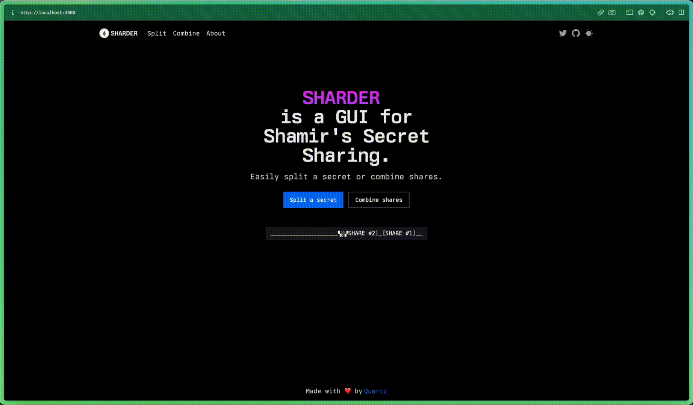

<h1 align="center">sharder</h1>

<p align="center">
  
</p>

<p align="center">
    A GUI for Shamir's Secret Sharing.
</p>

## Disclaimer

While Sharder uses an audited library to perform the split and combine operations on a given secret,
the platform itself is provided as is and comes with no security guarantees.

Consider Sharder as it is right now as an advanced proof-of-concept.

## Acknowledgments

Before we continue, we want to say thank you to [privy-io](https://www.privy.io/), as we used their
audited [TS implementation](https://github.com/privy-io/shamir-secret-sharing) of shamir secret sharing.

Without them, this project could not exist!
If you like Sharder, consider leaving a star to their repository as well!

## Introduction

As we came across the concept of [Shamir's Secret Sharing](https://en.wikipedia.org/wiki/Shamir%27s_secret_sharing),
we wanted to create a platform where users could easily split a secret into shares and perform the inverse operation.

We also wanted to preserve some kind of privacy by ensuring that all operations will be executed on the user's side:
that's why there is no backend in Sharder.

We hope that this project will help in any kind of way!

## Getting Started

If you want to run Sharder locally, first make sure that you have node and yarn installed.

Once you have cloned the repository, install the dependencies using
```shell
yarn install
```

Start the dev version of Sharder using:
```shell
yarn dev
```

And reach [`http://localhost:3000`](http://localhost:3000) to access the platform.

## Coming Soon

We are actively developing new features, including:
- `Shares Encryption`

    In the split configuration panel, you will be able to select which shares to encrypt and what method of encryption to use.
    This gives the ability to the sender to "restrict" access to the shares content.


- `Shares Sharing`

    In the download panel, the user who has split his secret will be able to easily share the shares using common methods.

## Contributing

If you would like to contribute to this project, please refer to the instructions in the
dedicated document [here](./CONTRIBUTING.md).

## Security

If you've found any kind of security issue in our codebase, please address it by sending
an email at [luca@quartz.technology](mailto:luca@quartz.technology).

## Authors

Made with ❤️ by the folks at Quartz, with the help of our close friends.